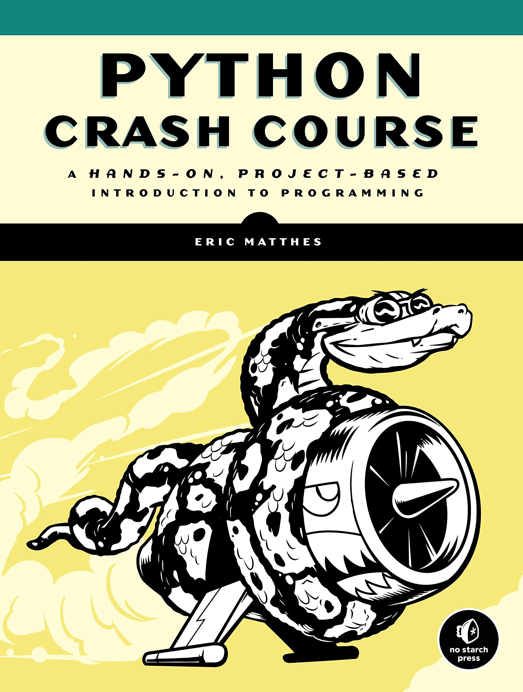

# Python Crash Course Book Exercises

A Hands-On, Project-Based Introduction to Programming
This is a collection of solutions for exercises  in the Python Crash Course book, an introductory programming book from No Starch Press by **Eric Matthes**.
 
The book is divided into two parts, the part one has 11 chapters. end exercises and the second part has 3 projects based on 3 areas in the python programming ecosystem and more broadly in the programming world:
1. Game development with *pygame*
2. Data science with *matplotlib and Pygal*
3. Web programming with *Django*
  

-----------------------------------------------------
If you have any questions about Python Crash Course, feel free to get in touch:

Email: ehmatthes@gmail.com

Twitter: [@ehmatthes](https://twitter.com/ehmatthes/)

Book: [Python crash course](https://nostarch.com/pythoncrashcourse2e)

